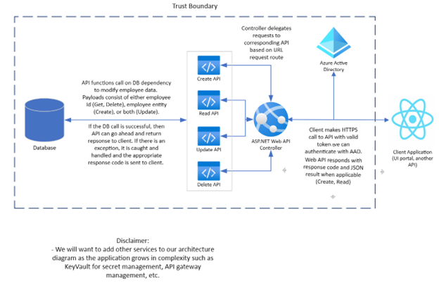

# Employee Management Application

This application is a simple Employee Management System built with ASP.NET Core and Entity Framework. It allows you to manage employee data.

## Prerequisites

- .NET Core 3.1 or later
- Entity Framework Core 3.1 or later

## Running the Application

1. Clone the repository to your local machine.
2. Navigate to the root directory of the EmployeeAPI project in your terminal.
3. Run the command `dotnet restore` to restore the necessary packages.
4. Run the command `dotnet dev-certs https --trust` and click Yes on the dialog popup.
5. Run the command `dotnet run --launch-profile https` to start the application.

## Accessing Swagger UI

Once the application is running, you can access the Swagger UI to test the API endpoints by navigating to `http://localhost:5037/swagger` in your web browser.

## Application Features

- **Employee Management**: Create, read, update, and delete employees.
- **Validation**: The application includes validation checks such as ensuring there are no duplicate `email` attributes among employees.

## Architecture

## Assumptions

### Application Assumptions:

1. **ActionResult of EmployeeController**: Assume the clients consuming our microservice are responsible for displaying employee data to end-users. So, our microservice will only be responsible for performing the CRUD operations on employee data and returning JsonResult where applicable (Create, Read).
2. **Authentication/Authorization**: Clients are responsible for authentication and will include a valid authentication token in the request header. Basic authentication mechanisms (ex. API key, JWT) are sufficient for the purpose of this exercise.
3. **Data Store**: We will use an Internal Database Context to store data for the purpose of this exercise. In an enterprise application, we would like to use an elastically scaling database with flexible data modeling, such as CosmosDB.
4. **Error Handling**: Error handling is simplified for the purpose of this exercise. Simple error codes are sufficient, although in an enterprise application more detailed error handling mechanisms may be required.
5. **Logging and Monitoring**: The use of basic logging for debugging purposes, but detailed logging for telemetry and metric reporting are not in scope for this exercise.
6. **Security**: Communication between clients and our microservice is over HTTPS. Input validation is basic and focused on preventing obvious security vulnerabilities. The use of API keys to connect to backend infrastructure is accepted in this exercise, however in an enterprise application we would want to store connection strings/API keys in a secrets manager like KeyVault.
7. **Documentation**: Detailed documentation is not required for this exercise. Comments will be used in code where necessary.
8. **Testing**: Unit tests to test code local to the repository are sufficient for this exercise. System integration tests are out of scope but would be required in an enterprise application. Since no code is required for tests in this exercise, we will create the test project and outline the tests in a xUnit test file. Performance and load testing should be handled using another tool such as Apache JMeter.
9. **Concurrency and Transactions**: We will omit complex concurrency control mechanisms for simplicity and assume a single-threaded model. Transactions are straightforward and there are no complex scenarios involving distributed scenarios.

### Data Assumptions:

1. **Attributes of the Employee Entity**: We will assume basic employee attributes such as Id, firstName, lastName, email, phoneNumber, address, startDate, department, and status.
2. **Uniqueness constraints**: Each employee has a unique identifier (Id) as well as a unique email address (email).
3. **Localization**: We will assume that localization of certain attributes such as address are out of scope for this exercise and English is sufficient.
4. **Permission/Access Controls**: We assume that anybody who has access to our microservice’s endpoints has the hierarchical access needed to perform those operations.
5. **Data Validation**: Basic input validation is necessary to ensure that the data adheres to specified formats and constraints. phoneNumber and email format. startDate is standardized to ISO 8601.
6. **Soft Delete**: Soft delete is out of scope for this exercise. Once an employee entity is deleted, it can be considered deleted permanently.

## Interfaces

1. `Employee.cs` – the employee data object model
   - `Id`
   - `FirstName`
   - `LastName`
   - `Email`
   - `PhoneNumber`
   - `Address`
   - `StartDate`
   - `Department`
   - `Status`
   - In the future, developers may consider creating a data transfer object, where the `Id` field becomes system managed instead of supplied by the client application.
2. `EmployeeContext.cs` – the employee database context model
   - `Employees` – The database set provided by Entity Framework for interacting with Employee objects in our database,
   - This is the database context model we will use to host our in-memory database for testing our APIs.

## Tests

1. `GET: api/Employees`
   - Test when the database is empty.
   - Test when the database has one or more employees.
2. `GET: api/Employees/{id}`
   - Test when the specified employee ID does not exist in the database.
   - Test when the specified employee ID exists in the database.
3. `PUT: api/Employees/{id}`
   - Test when the specified employee ID does not match the ID in the request body.
   - Test when the model state is invalid.
   - Test when an employee with the same email already exists.
   - Test when the specified employee ID exists in the database and the model is valid.
4. `POST: api/Employees`
   - Test when the model state is invalid.
   - Test when an employee with the same email already exists.
   - Test when an employee with the same ID already exists.
   - Test when the request is valid.
5. `DELETE: api/Employees/{id}`
   - Test when the specified employee ID does not exist in the database.
   - Test when the specified employee ID exists in the database.
